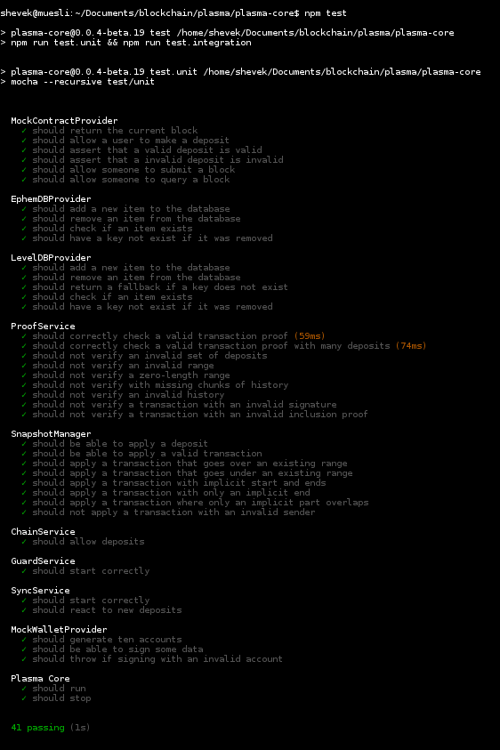
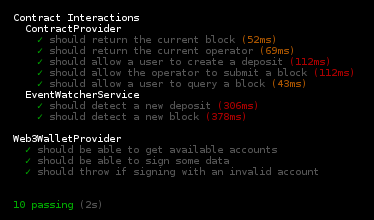

# Plasma Roundup: From MVP to Plasma Group
By Chris Spannos

Ethereum second layer scaling technology has come a long way in a very short period of time.

It was in August 2017 when Plasma creators Joseph Poon and Vitalik Buterin [proposed this framework](https://plasma.io/plasma.pdf) which they hoped would scale Ethereum transaction throughput to a "significant amount of state updates per second," potentially more than Paypal, Visa or other widely used merchant service providers.

Aside from promising comparable, if not more, transactions per second Plasma staked its security on the value of Ethereum's decentralized mainchain rather than in a centralized merchant service.

The promise of Plasma lays in its potential to help scale blockchain technology by enabling mass adoption through processing a substantial amount of decentralized financial applications worldwide.

In January 2018, Vitalik posted the [“minimal viable plasma” (MVP) specification to the Ethresearch forums](https://ethresear.ch/t/minimal-viable-plasma/426). The specification was designed to offer simplicity and basic security properties to kickstart development. Teams immediately began working on their own implementations.

This overview is not meant to be exhaustive, but, by highlighting a few implementations it aims to be indicative of the progress that Plasma has made over the past year.

Although none of the Plasma models reviewed below are on mainnet or production ready, by reviewing a few examples I hope to demonstrate that this technology is moving beyond theory and, as a whole, is not far away from production and mainnet release.     

Among the early Plasma implementations was [FourthState Labs](https://github.com/FourthState/plasma-mvp-rootchain), who's design included a rootchain contract implementation according to the Plasma MVP. This rootchain, which has been incorporated into other implementations, is pretty simple to test. To do so, I used this set up for my environment:

* Linux (Debian Stretch)
* Truffle (v5.0.2)
* Ganache CLI (v6.2.5)
* NPM 6.7.0

Then I followed these steps:

0. `$ git clone https://github.com/fourthstate/plasma-mvp-rootchain`
1. `$ cd plasma-mvp-rootchain`
2. `$ npm install`
3. `$ npm install -g truffle ganache-cli` // if not installed already
4. `$ ganache-cli` // run as a background process
5. `$ npm test`

Other early MVP's included the [OmiseGO's research implementation](https://github.com/omisego/plasma-mvp), which included a root chain, child chain and a client to interact with the Plasma chain.

[Kyokan](https://github.com/kyokan/plasma), a Golang implementation that [extends the original MVP specification](https://kauri.io/article/7f9e1c04f3964016806becc33003bdf3/v4/minimum-viable-plasma-the-kyokan-implementation), uses the FourthState rootchain contract reviewed above. The architecture uses Root Nodes to process transactions and package them into blocks, broadcasts blocks to validator nodes, processes exits and more.

In Kyokan, validator Nodes check the validity of blocks and exit if bad behavior is detected. The Plasma Contract lives on the Ethereum root chain and supports deposits, block submissions, exits and challenges. Kyokan has deployed their [Plasma Block Explorer](https://explorer.kyokan.io/) on the Rinkeby test net:

Closing 2018, the [Plasma Group](https://plasma.group/) [announced the release of their open implementation](https://medium.com/plasma-group/plasma-spec-9d98d0f2fccf) aimed at the greater Ethereum community. It includes a Plasma chain operator, a client and command line wallet, support for ERC20 tokens, a block explorer, transaction load testing and more.

Many aspects of [this implementation are currently testable](https://github.com/plasma-group). To test the [Plasma Core](https://github.com/plasma-group/plasma-core) (again using the Debian, Ganache, NPM environment), follow these steps:

0. `git clone git@github.com:plasma-group/plasma-core.git`
1. `cd plasma-core`
2. `npm install`
3. `npm test`

To run Plasma Group's [chain operator](https://github.com/plasma-group/plasma-chain-operator):

0. `$ npm install plasma-chain [-g]` # install the plasma chain operator. Global flag is optional, if you don't use global, just replace all of the following commands with `npm run plamsa-chain [command]`. If you can't install globally without `sudo` then just use local!
1. `$ plasma-chain account new`  # create a new account.
2. # On Rinkeby testnet, send your new Operator address ~0.5 ETH. You can use a faucet to get test ETH for free here: https://faucet.rinkeby.io/
3. `$ plasma-chain list` # list all the plasma chains which others have deployed to the Plasma Network Registry.
4. `$ plasma-chain deploy` # deploy a new Plasma Chain. Note you will be prompted for a unique Plasma Chain name & IP address. If you are running on your laptop, just set the IP to `0.0.0.0` as you probably don't
want to reveal your IP to the public. However, if you are running in a data center and would
like to accept Plasma transactions & serve a block explorer to the public, go ahead and set an IP.
5. `$ plasma-chain start` # start your new Plasma Chain.
6. [optional] Open a new terminal. In this new terminal use the following command:
`$ plasma-chain testSwarm` # spam your Plasma Chain with tons of test transactions

You can also view your local block explorer at http:127.0.0.1:8000

Plasma seems to be taking a great leap forward, but there are still a few obsitlces to overcome. Implementations need to be audited and tested much more.  
